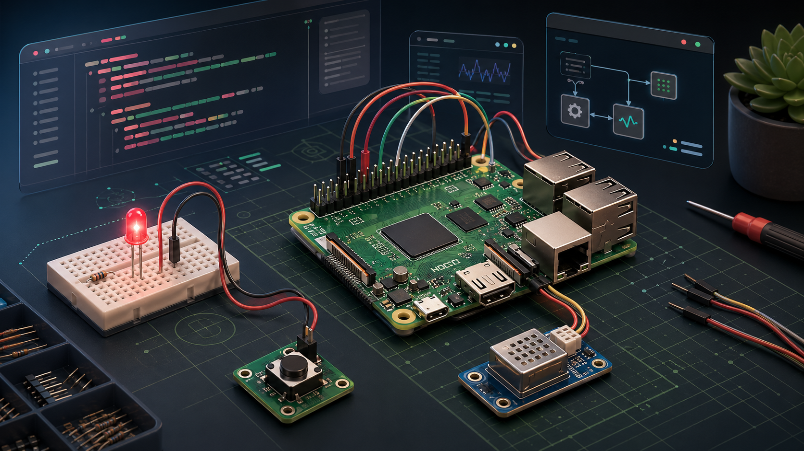

# Raspberry Pi Maker



Raspberry Pi Maker is a native OpenClaw plugin for planning, wiring, coding, and debugging Raspberry Pi hardware projects.

## What It Provides

- A focused OpenClaw skill at `skills/raspberry-pi-maker/SKILL.md`
- GPIO and interface reference material
- Beginner, intermediate, and advanced project guides
- A generated README hero image at `assets/raspberry-pi-maker-hero.png`
- Troubleshooting workflows for GPIO, I2C, camera, networking, boot, and service issues
- A local validation script for plugin metadata, skill frontmatter, and markdown links

## Safety Scope

This plugin provides educational guidance for low-voltage Raspberry Pi projects. Users are responsible for verifying wiring before applying power and for using appropriate drivers, level shifting, fuses, isolation, and enclosures for their hardware.

Do not use Raspberry Pi GPIO pins to directly drive motors, mains voltage, high-current loads, relays without suitable driver circuitry, or any safety-critical system.

## OpenClaw Plugin Format

This project is packaged as a native OpenClaw plugin with a lightweight runtime entrypoint and a declared skill root.

OpenClaw detects the plugin from:

- `package.json` with `openclaw.extensions`
- `openclaw.plugin.json`
- `skills/`

The manifest declares `skills: ["skills"]`, so OpenClaw loads the bundled skill when the plugin is enabled.

## Install From npm

After this package is published:

```bash
openclaw plugins install raspberry-pi-maker
openclaw gateway restart
openclaw plugins inspect raspberry-pi-maker
openclaw skills info raspberry-pi-maker
```

## Publish Checklist

Before publishing:

```bash
npm test
node --check index.js
npm pack --dry-run
```

`npm pack --dry-run` should show only the public plugin files, documentation, references, validator, and README image.

The package also has `prepack` and `prepublishOnly` scripts that run the release checks automatically.

## Install Locally

From the parent directory:

```bash
openclaw plugins install ./raspberry-pi-maker --link
openclaw gateway restart
openclaw plugins list
openclaw skills list
```

Without `--link`, OpenClaw copies the plugin into its managed install area. With `--link`, edits in this repository remain live after refresh.

## Validate During Development

Run the repository validator:

```bash
npm test
```

Before publishing or sharing a release, also run:

```bash
node --check index.js
npm pack --dry-run
openclaw plugins install ./raspberry-pi-maker --link
openclaw skills info raspberry-pi-maker
```

Recommended OpenClaw checks after installation:

```bash
openclaw plugins doctor
openclaw plugins inspect raspberry-pi-maker
openclaw skills check
```

## Repository Layout

```text
package.json                       npm metadata and OpenClaw entrypoint declaration
openclaw.plugin.json               OpenClaw manifest and skill root declaration
index.js                           Lightweight native plugin entrypoint
assets/                            README and package image assets
skills/raspberry-pi-maker/SKILL.md OpenClaw-loaded Raspberry Pi skill
references/                        Supporting GPIO, troubleshooting, and project docs
scripts/validate_plugin.py         Dependency-free local validation
CHANGELOG.md                       Release history
SECURITY.md                        Security and hardware-safety reporting policy
```

## Contributing

See [CONTRIBUTING.md](CONTRIBUTING.md) for safety and validation standards.

## Security

See [SECURITY.md](SECURITY.md) for vulnerability reporting and hardware-safety scope.

## License

MIT. See [LICENSE](LICENSE).
